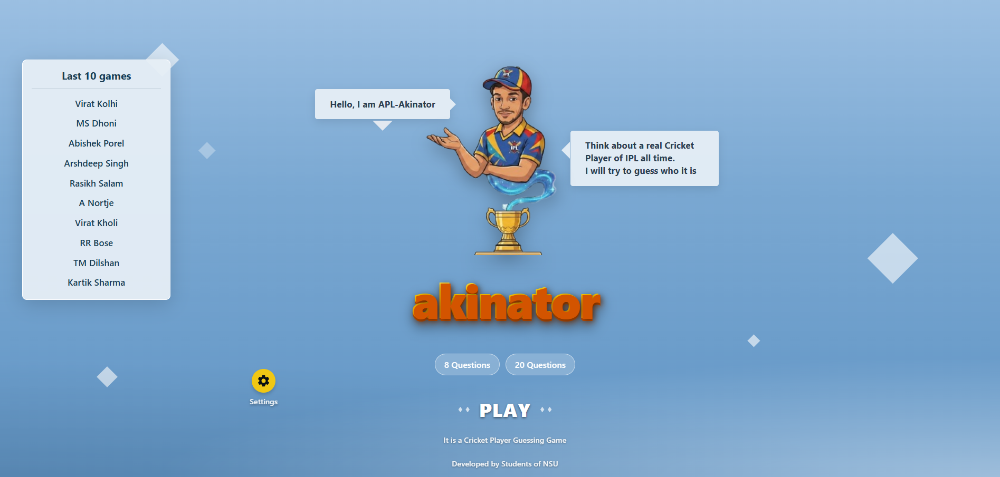
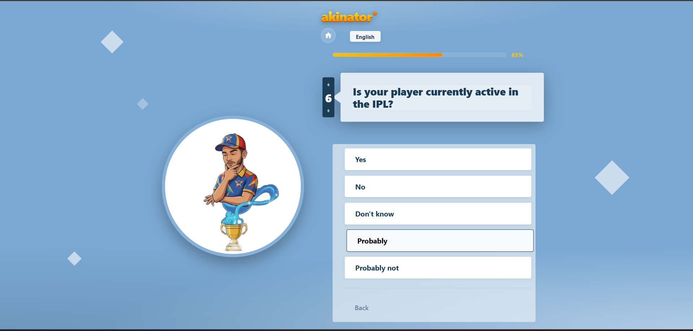
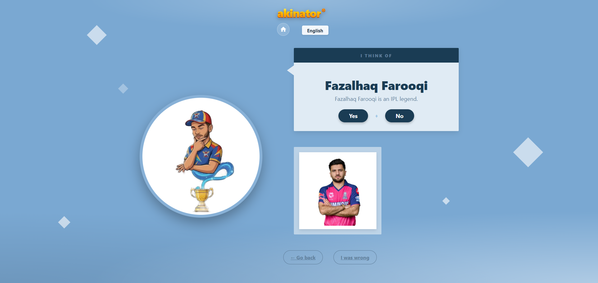

# 🧞‍♂️ Akinator: IPL Player Edition 🏏

### *The Ultimate AI-Powered Cricket Player Guessing Game*

[](https://reactjs.org/)
[](https://fastapi.tiangolo.com/)
[](https://vitejs.dev/)

---

## 🌟 Overview
**Akinator: IPL Edition** is a full-stack web application that brings the magic of the famous Genie to the world of Cricket. Using a custom-built deductive reasoning engine, the app can guess any IPL player (past or present) that you are thinking of in 20 questions or less.

Built for a hackathon, this project showcases a blend of **State-Aware AI Logic**, **Interactive UI/UX**, and a **Mobile-First Design**.

---

## 📸 Screenshots
| Home Screen | During Gameplay | Guess Result |
| :---: | :---: | :---: |
|  |  |  |
*(Note: Add your screenshots to a `/screenshots` folder to see them here!)*

---

## ✨ Key Features

### 🧠 Intelligent Deduction Engine
- **Probability-Based Logic:** Powered by a FastAPI backend that calculates candidate scores based on 30+ unique player attributes.
- **Dynamic Questioning:** The engine adaptively chooses the next question to eliminate the maximum number of candidates.

### 🎭 Premium Interactive UI
- **Animated Mascot:** A high-fidelity video mascot that creates an immersive, "alive" atmosphere.
- **Visual Progress:** A real-time progress bar and question-counter tab show the AI's "confidence" as it narrows down the player.
- **Tactile Design:** Custom-built buttons and bubble-styled UI for a playful, game-like experience.

### 📊 IPL Ecosystem
- **Comprehensive Dataset:** Covers legends like Dhoni and Kohli to rising stars and retired greats.
- **Correction Mode:** A built-in feedback loop where users can "teach" the Genie if he gets a guess wrong, allowing the dataset to evolve.

---

## 🛠️ Technical Stack

**Frontend:**
- **React 18** for component-based UI.
- **Vanilla CSS** for a fully custom, lightweight design system.
- **Anime.js** for smooth, high-performance transitions.
- **Vite** for optimized production builds.

**Backend:**
- **FastAPI (Python)** for the high-speed inference engine.
- **Custom Search Algorithm** for attribute-based filtering.

---

## 🚀 Getting Started

### Prerequisites
- Node.js (v16+)
- Python 3.9+

### 1. Setup Backend
```bash
cd backend
python -m venv venv
source venv/bin/activate  # On Windows: venv\Scripts\activate
pip install -r requirements.txt
uvicorn main:app --reload
```

### 2. Setup Frontend
```bash
cd frontend
npm install
npm run dev
```

---

## 🤝 Developed By
**Students of NSU**
*Developed for the Hackathon 2026*

---

## 📜 License
This project is for educational/hackathon purposes only. All player names and team logos are trademarks of their respective owners.
